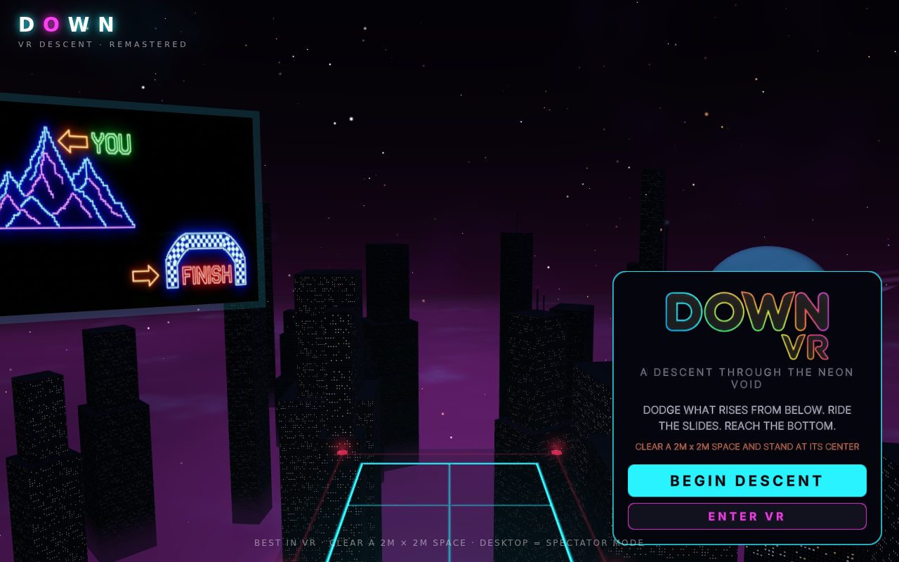
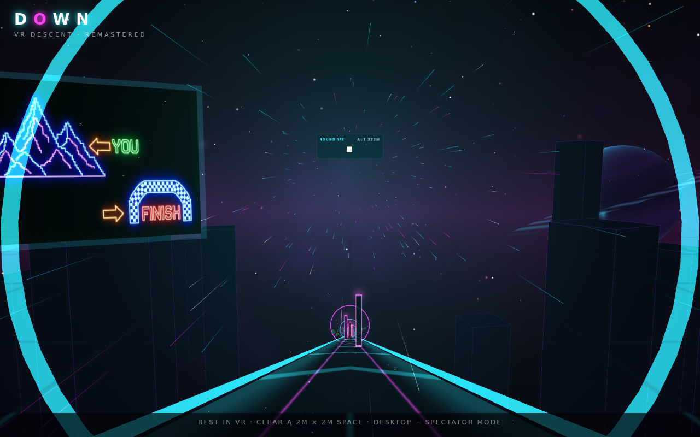
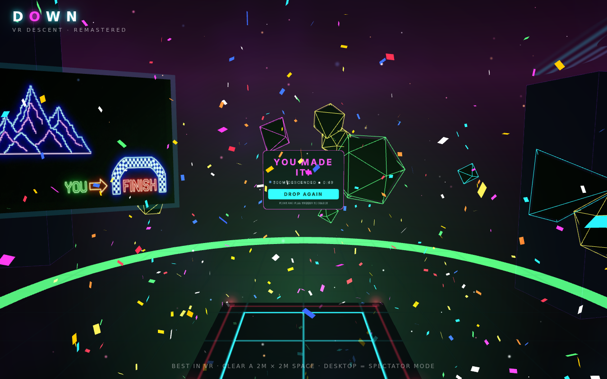

# DOWN — VR Descent, Remastered

A roomscale VR descent game for the immersive web, rebuilt on Meta's
[Immersive Web SDK](https://developers.meta.com/horizon/documentation/web/immersive-web-sdk/)
(IWSDK + Three.js + WebXR).

**Play it:** <https://yellkell.github.io/down/> — deployed from CI on every
push (the original lives at [`/legacy/`](https://yellkell.github.io/down/legacy/),
the Christmas sled at [`/vrxmas/`](https://yellkell.github.io/down/vrxmas/)).

You start 300 meters up, standing on a floating neon platform in the void.
Dodge the glowing shapes that surge up through the grid, survive the round,
then ride a long, steep 32° slide of light down to the next platform. Three
rounds, two slides, and one final 220-meter victory drop to a finish zone
that stays hidden in the fog until you commit to it. Each landing lands with
a shockwave and a beat to steady yourself before the next round rises.

| Start | Slide | Finish |
| --- | --- | --- |
|  |  |  |

## How to play

- **Landing page**: the browser opens on a 2D intro with the DOWN wordmark.
  Press **ENTER VR** to put on the headset (auto-detected) — then a lobby
  panel waits in VR until you press **BEGIN DESCENT** (button or trigger).
  Or **PREVIEW IN BROWSER** to watch on desktop right away.
- **Best in VR** (Quest browser or any WebXR headset). Clear a **2m × 2m**
  space and stand at its center — you dodge with your real body.
- **Dodge rounds**: shapes rise from below; every wave leaves one quadrant
  safe. Deck rings telegraph where the next ones surface. Step off the red
  boundary and the void takes you.
- **Slides**: lean left / center / right to slip between the barriers.
- **Desktop browser** is spectator mode — the descent plays out as an
  attract loop and nothing can hurt you.

## Run it

```bash
npm install
npm run dev        # Vite + HTTPS (mkcert) + IWER emulator on :8081
NO_HTTPS=1 npm run dev   # plain http://localhost:8081 (no cert download)
npm run build      # production build to dist/
npm run preview    # serve the production build
```

- HTTPS matters when testing on a headset over LAN; plain HTTP is fine for
  `localhost`.
- On desktop, the dev server injects the **IWER** emulator so you can fake a
  Quest 3 (move the headset in the dev panel to dodge).
- Add `?turbo` to the URL to shorten dodge rounds to 6 seconds when testing
  the slides and win flow.

## Project layout

```
index.html          landing shell + loading screen
src/
  index.ts          world bootstrap: assets, panels, systems
  constants.ts      all game tuning in one place
  state.ts          shared game state + tiny event bus
  audio.ts          "Run" soundtrack, voice lines + stingers (HTMLAudio)
  systems/          ECS systems: game referee, spawner, slide, environment
  env/              the void: sky, platform, track, structures, extras
ui/                 UIKitML spatial panels (start / HUD / warning / end)
public/             audio + sign textures (the original 2019 assets)
legacy/             the untouched original A-Frame version
vrxmas/             a separate little Christmas sled experience
```

## What changed from the original

The original (preserved in [`legacy/`](legacy/)) was a single A-Frame page
with hand-placed star spheres and copy-pasted slide blocks — a first VR
project, and it shows in the best way. The remaster keeps its soul (same
three-phase descent, same round timings, same lane patterns, same sign
artwork — with the slides steepened from 20° to 32° so the drop looks
like one, and a new soundtrack, "Run", with voice-line rewards after
every slide) and rebuilds everything around it:

- **A-Frame → IWSDK**: TypeScript, ECS systems, UIKitML spatial UI panels,
  Vite build, desktop emulator for development.
- **25 star spheres → a world**: 2,600 twinkling GPU stars, an FBM nebula
  dome, a ringed gas giant, and a cyberpunk skyline of 60 towers alive
  with baked lit windows, their bases dissolving into a luminous cloud
  sea so the city has no visible bottom.
- **Static slide décor → generated tracks**: each slide builds its ribbon
  of light where you actually ride, with flowing chevrons, lane lines, and
  energy hoops to fly through.
- **The descent is cut to the soundtrack**: "Run" rides a strict 5-second
  bar loop, and every slide launches exactly on the bar grid — the
  countdown beeps ride the last bars, and the final drop launches on the
  song's biggest crash, riding its most intense stretch down.
- **Polish where it counts in VR**: telegraph rings for incoming shapes, a
  kill-zone that glows when you drift toward it, slide-warning deck pulses
  with countdown beeps, wind streaks and a comfort vignette at speed, an
  eased launch/landing on every slide, and a soft-reset RETRY instead of a
  page reload.
